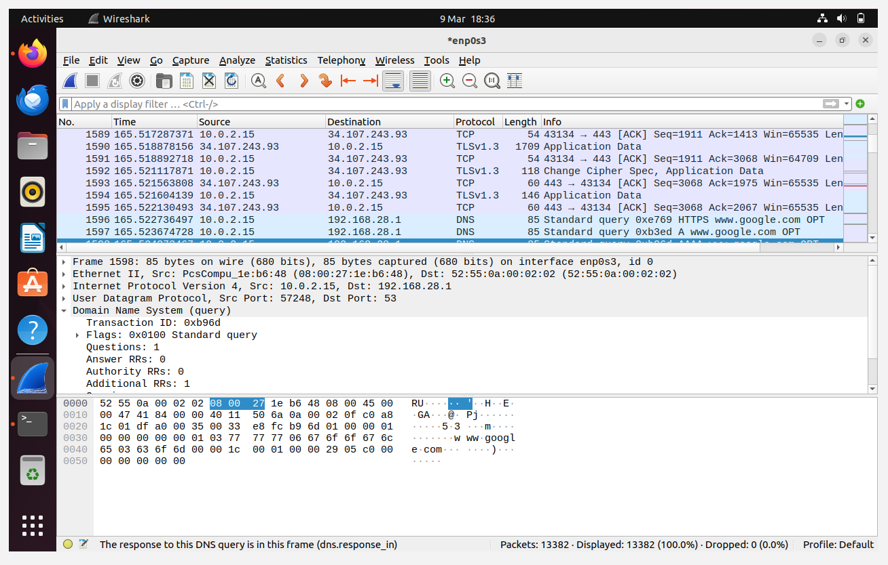
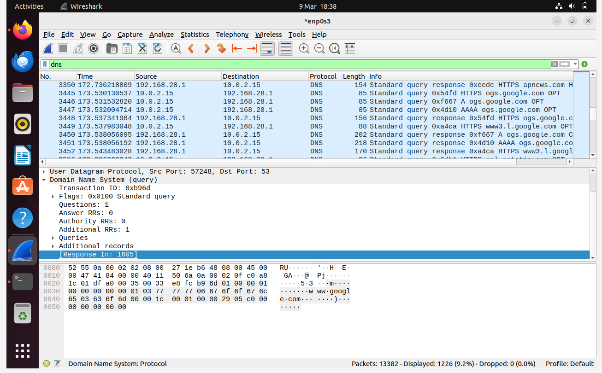
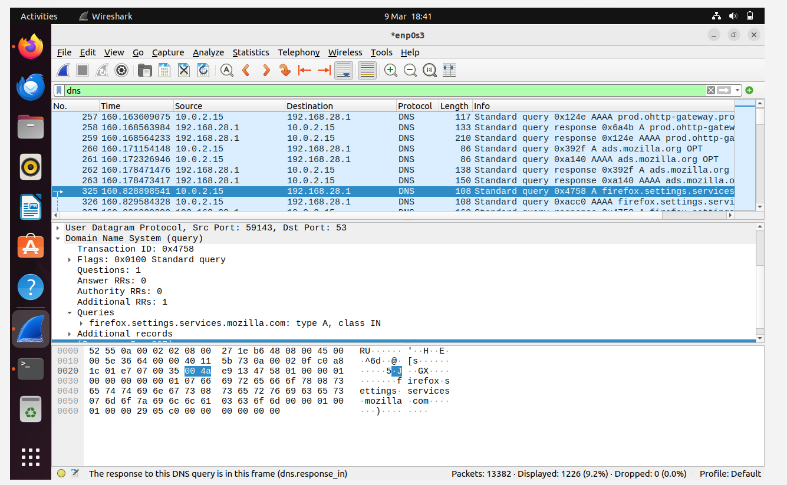
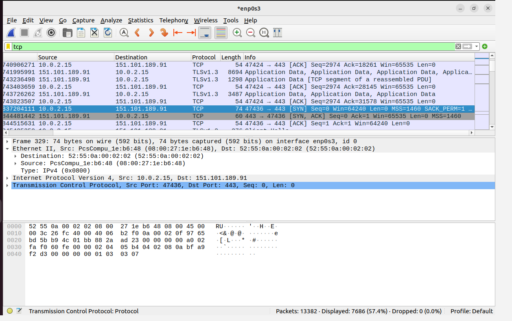
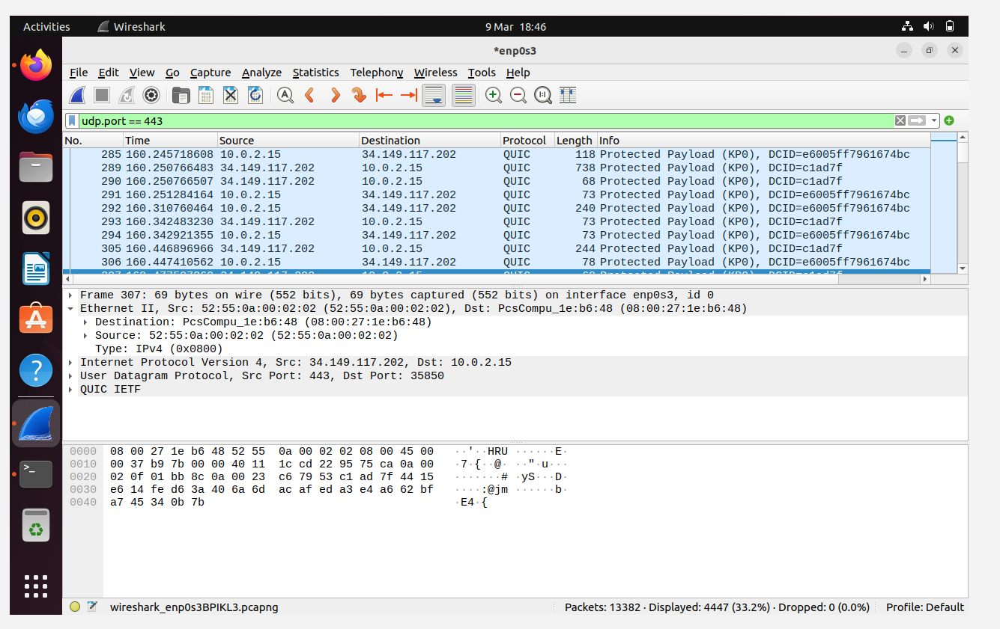
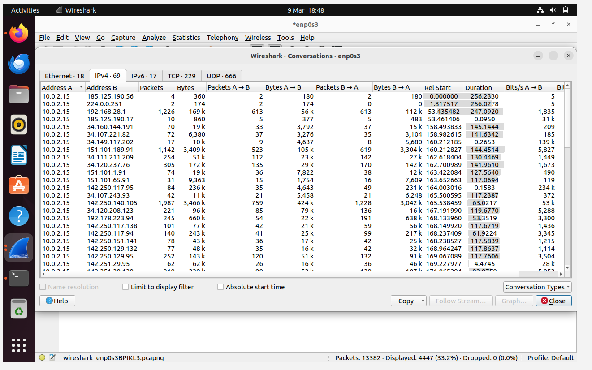
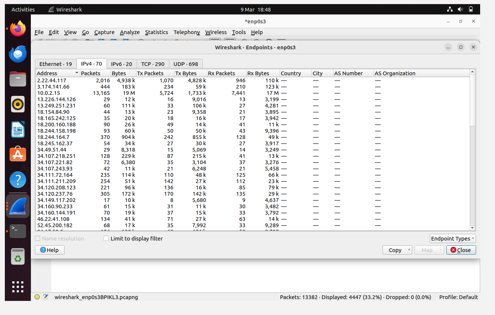

# Wireshark Network Traffic Analysis

## Project Overview

This project demonstrates practical network traffic analysis using Wireshark.  
The objective of the project was to capture and analyze network traffic generated during normal web browsing activity and investigate the protocols and external systems involved in the communication.

The analysis focuses on identifying:

- DNS queries
- TCP connection establishment
- Encrypted web traffic (HTTPS / QUIC)
- External servers contacted during browsing
- Network conversations and endpoints

---

## Environment

Operating System: Ubuntu Desktop (Virtual Machine)

Network Interface: enp0s3

Tool Used: Wireshark 3.6.2

Network Type: NAT virtual network

---

## Traffic Capture Procedure

A live packet capture was conducted using Wireshark on the `enp0s3` network interface.

The following steps were performed to generate network traffic:

1. Wireshark capture was started.
2. A web browser was opened.
3. The website `google.com` was visited.
4. The website `bbc.com` was then visited.
5. After the pages loaded, the packet capture was stopped.

The packets generated during this browsing activity were then used for the analysis in this project.

Total packets captured:

13,382 packets

---

## Packet Capture Overview

The capture contains multiple network protocols including:

- DNS
- TCP
- UDP
- TLS
- QUIC

These protocols represent the process of resolving domain names, establishing connections, and transferring encrypted web traffic.

Screenshot:

---

## DNS Analysis

DNS traffic was analyzed to identify the domain names contacted during the browsing activity.

DNS queries revealed several domains including:

- www.google.com
- push.services.mozilla.com
- www.irishexaminer.com
- www.stylist.co.uk

DNS queries were sent from the client machine:

10.0.2.15

to the DNS resolver:

192.168.28.1

DNS responses returned the IP addresses associated with the requested domains.

Screenshot:

---

## DNS Packet Investigation

Individual DNS packets were examined to identify the domain names and query types.

The packet details section of Wireshark shows the domain name being resolved along with the query type and response information.

Screenshot:

---

## TCP Connection Analysis

The packet capture shows the TCP three-way handshake used to establish communication between the client and remote servers.

The handshake occurs in three steps:

1. SYN
2. SYN-ACK
3. ACK

This process ensures that both systems are ready before data transmission begins.

Screenshot:

---

## HTTPS and QUIC Traffic

Most of the web communication observed in the capture uses encrypted protocols.

Traffic analysis revealed communication over port 443 using QUIC protocol.  
This indicates HTTP/3 traffic, which runs over UDP rather than TCP.

QUIC improves web performance by reducing connection latency and improving reliability.

Screenshot:

---

## Network Conversations

Wireshark's conversation statistics were used to identify which systems exchanged the most data with the client machine.

This analysis helps identify the most active communications in the capture.

Screenshot:

---

## Endpoint Analysis

Endpoint statistics were used to identify all IP addresses that communicated with the host during the capture session.

This analysis revealed multiple external servers associated with cloud infrastructure and content delivery networks.

Screenshot:

---

## Repository Structure

wireshark-network-traffic-analysis
│
├── README.md
├── documentation
├── screenshots
└── pcap

---

## Detailed Report

A more detailed analysis is available in:

documentation/wireshark_analysis_report.md

---

## Conclusion

This project demonstrates how Wireshark can be used to capture and analyze real network traffic generated by everyday browsing activity.

The analysis revealed DNS resolution activity, TCP connection establishment, encrypted web communication, and communication with external servers.

These techniques are fundamental skills used in cybersecurity, network monitoring, and digital forensics.
